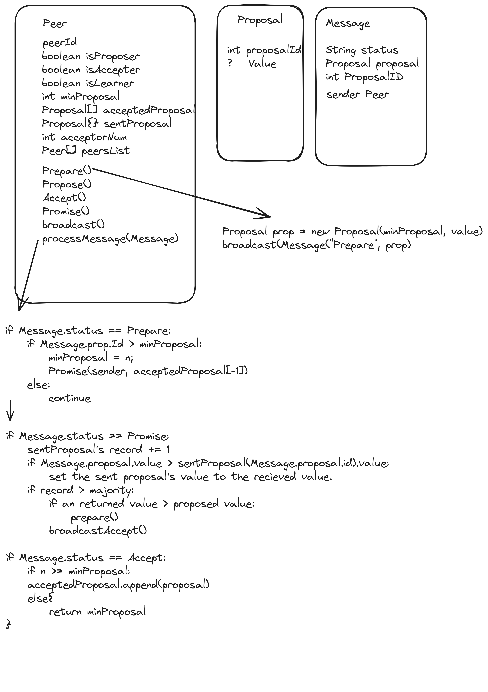

# Technical Report: Implementation of the Paxos Algorithm in a Distributed System

## System Design

### Main Class

- **Function**: Initializes and starts the Paxos process based on command-line arguments.
- **Execution**:
    - Parses command-line arguments to determine the peer's role, value to propose, and other settings.
    - Reads a configuration file to gather information about all peers in the system.
    - Initializes a `Peer` object with the appropriate settings and starts it on a new thread.

### Peer Class

- **Role**: Represents a single participant (or node) in the Paxos algorithm.
- **Key Fields**:
    - `peerId`: Unique identifier for the peer.
    - `isProposer`, `isAcceptor`, `isLearner`: Booleans indicating the role(s) the peer plays in the Paxos algorithm.
    - `messageQueue`: A thread-safe queue for incoming messages.
    - `serverSocket`: For listening to incoming TCP connections.
    - `executor`: An executor service for managing threads.
- **Functionality**:
    - Runs a server to accept incoming connections.
    - Processes incoming messages based on their type (e.g., "Prepare", "Promise").
    - Participates in the consensus process by proposing values, responding to proposals, and learning agreed-upon values.

### Message Class

- **Role**: Encapsulates messages exchanged between peers.
- **Fields**:
    - `status`: The type of message (e.g., "Prepare", "Accept").
    - `proposal`: Contains the proposal ID and value.
    - `senderName`: The name of the peer who sent the message.

### Proposal Class

- **Role**: Represents a proposal in the Paxos algorithm.
- **Fields**:
    - `proposalId`: A unique identifier for the proposal.
    - `value`: The value being proposed.

## Execution Logic

### Initialization

1. The `Main` class reads command-line arguments and configuration files to determine the roles and connections of the peer.
2. It creates a `Peer` object and starts its execution in a separate thread.

### Peer Operations

1. **Listening for Connections**:
    - Each peer runs a server socket in a separate thread to accept incoming connections.
    - New connections are handed off to the executor for individual processing.

2. **Message Processing**:
    - Incoming messages are added to a `messageQueue`.
    - A main loop continuously takes messages from this queue and processes them based on their type and the peer's roles.

3. **Role-Based Logic**:
    - As a **Proposer**, the peer initiates proposals and handles responses from acceptors.
    - As an **Acceptor**, the peer responds to proposals by either promising or rejecting.
    - As a **Learner**, the peer observes the process and learns the consensus value.

### Paxos Algorithm Flow

1. **Proposal Initiation**:
    - A proposer generates a proposal with a unique number and a value.
    - It sends a "Prepare" message to acceptors requesting their promise.

2. **Promise Phase**:
    - Acceptors evaluate the "Prepare" request. If the proposal number is higher than any they have seen, they promise not to accept lower-numbered proposals.
    - Acceptors respond with a "Promise" message, which may include an already accepted proposal.

3. **Acceptance Phase**:
    - Upon receiving promises from a majority of acceptors, the proposer sends an "Accept" message with the chosen value.
    - Acceptors agree to this value if they haven't promised to a higher-numbered proposal.

4. **Learning and Consensus**:
    - Learners observe the process and determine when a value has been chosen.
    - Once a consensus is reached, learners can act on the agreed-upon value.

## Concurrency and Communication

- Concurrency is achieved through multi-threading, allowing each peer to handle multiple connections and messages simultaneously.
- Communication between peers is managed via TCP sockets, ensuring reliable message delivery.
